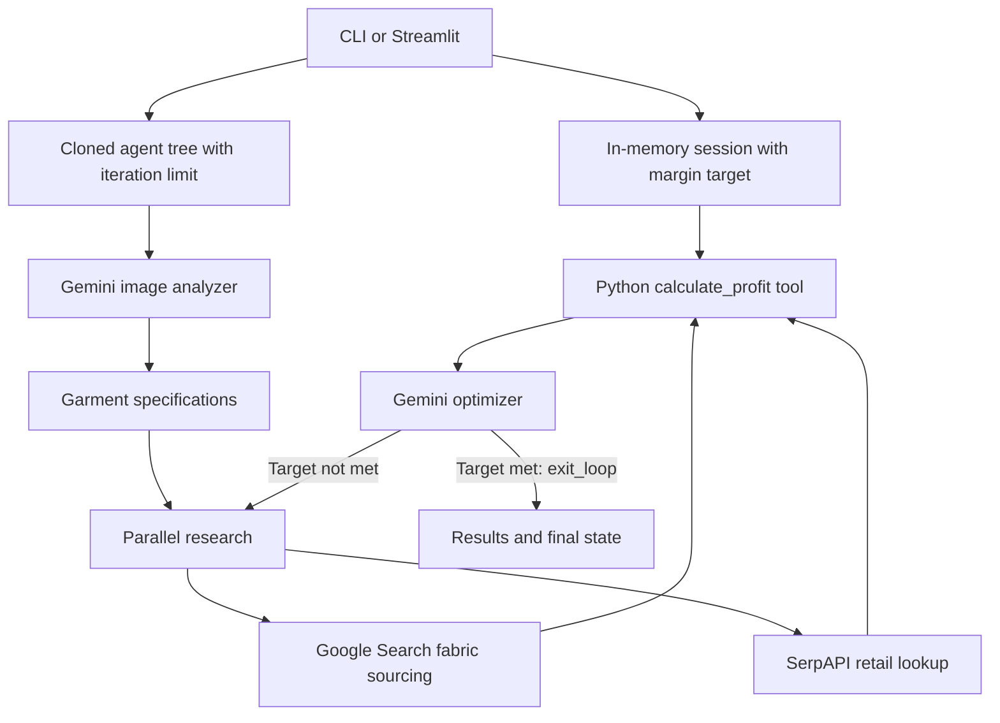
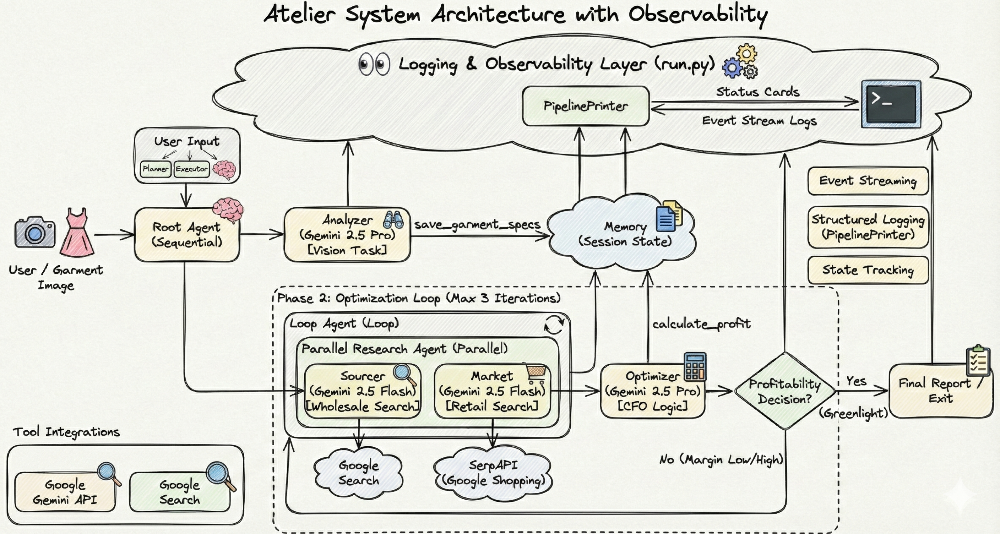

# Architecture

Modified for the standalone edition to document per-run configuration and the minimum-margin decision rule.

Atelier combines model-assisted research with a deterministic Python cost calculation. Both the CLI and Streamlit interface use the same agent workflow.

## Execution

The `LoopAgent` stops after its configured limit even if the model does not call `exit_loop`. The diagram's retry edge is bounded by that limit.

## Components

| Component | Responsibility |
| --- | --- |
| [run.py](run.py) | Validates CLI settings and image path, creates the session, and prints tool events and results |
| [app.py](app.py) | Accepts an image and settings, runs the pipeline, and renders results |
| [src/planner.py](src/planner.py) | Defines the four agent prompts and tool bindings |
| [src/executor.py](src/executor.py) | Exports the default agent and clones its tree for configured runs |
| [src/tools.py](src/tools.py) | Queries Shopping listings and calculates costs and margin |
| [src/memory.py](src/memory.py) | Writes garment specifications and optimization flags to tool context |

`build_root_agent` clones the agent tree so loop limits are not changed globally. Each entry point creates a separate `InMemorySessionService` for an analysis and stores `target_profit_margin` in that session.

## State Contract

| Key | Value |
| --- | --- |
| `target_profit_margin` | Requested minimum margin as a fraction; defaults to `0.40` when absent |
| `garment_specs` | Dictionary of garment type, fabric, yardage, and complexity |
| `garment_info` | Analyzer's textual summary |
| `fabric_cost` | Sourcing output with `price_per_yard` and `yards_needed` |
| `market_price` | Retail comparison with `average_price` and price range |
| `profit_analysis` | Calculated costs, profit, target, and `is_profitable` |
| `needs_optimization` | Legacy string flag: `initial`, `needed`, or `not needed` |
| `profit_result` | Optimizer's explanation |

Research results can be dictionaries or JSON strings; the calculator accepts either form. Required numeric values are validated before calculating profit. The legacy garment field `silhoutte` is retained for compatibility with the original tools and displays.

## Decision Rule

The Python calculator compares margin with the session's minimum target. The optimizer is instructed to use that boolean result, request cheaper sourcing below target, and call `exit_loop` on success. There is no upper-margin rejection rule.

Numeric validation does not verify the truth of model estimates. The workflow does not guarantee that the agents will obtain valid data or make a design profitable.

## External Services

- Gemini receives uploaded image bytes and the analysis prompt.
- Google Search is available to the fabric sourcing agent.
- SerpAPI receives a garment search query, using US-oriented Shopping defaults and a 30-second HTTP timeout.
- API credentials are loaded from the local environment and must not be committed.

The CLI emits tool inputs, tool results, model text, and the final session state. The web interface collects events before displaying its results; this is not a production telemetry or monitoring system.

## Original Diagram

The retained hackathon illustration is historical reference. Its fixed three-iteration label and low/high-margin loop describe the earlier design; the standalone behavior is documented above.

## Verification

[Offline tests](tests/test_pipeline.py) exercise the calculator, isolated loop settings, CLI session configuration, and Streamlit rendering. Live Gemini and search integrations require separate validation with authorized credentials and quota.

