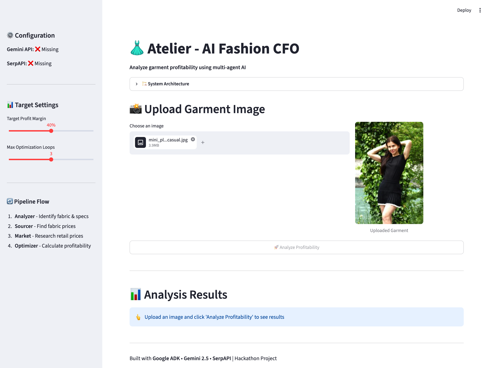
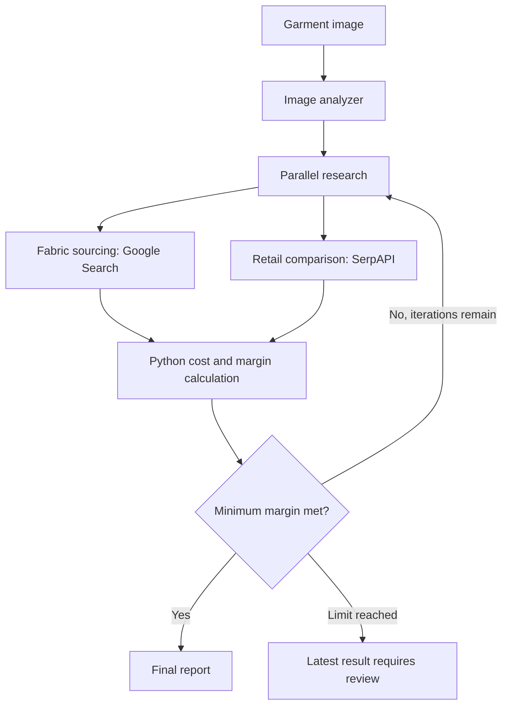

# Atelier

**AI-assisted garment costing and profitability analysis.**

Atelier turns a garment image into an estimated material breakdown, wholesale fabric research, comparable retail prices, and a cost-and-margin report. Four specialized agents coordinate through Google ADK, with a Streamlit interface and a command-line entry point.

**Python 3.12 | Google ADK | Gemini | Google Search | SerpAPI | Streamlit**

This is a hackathon prototype, not a production pricing system. Fabric identification, yardage, and labor are estimates; search results may be incomplete. No benchmark accuracy or business ROI is claimed.

[Quick Start](#quick-start) | [Architecture](ARCHITECTURE.md) | [Demo](DEMO.md) | [Tests](#tests)

## Interface Preview



Local interface with a sample image uploaded. API credentials are not configured in this capture; it does not show a live analysis result.

## Workflow

1. **Analyze:** Gemini inspects the image and saves garment type, fabric, estimated yardage, and construction complexity to session state.
2. **Research in parallel:** The sourcing agent searches wholesale fabric prices while the market agent queries Google Shopping through SerpAPI.
3. **Calculate:** A Python tool computes fabric cost, heuristic labor cost, and margin against the selected target.
4. **Refine:** The optimizer requests cheaper sourcing when the minimum margin is not met, or exits on success. An iteration limit bounds the loop.



## Quick Start

Use Python 3.12, the version used for the local checks and CI. Live analysis requires a Gemini API key and a SerpAPI key with available quota. Requests may incur provider charges.

### Install

```bash
git clone https://github.com/ANKI147/atelier-fashion-cfo.git
cd atelier-fashion-cfo
python3.12 -m venv .venv
source .venv/bin/activate
python -m pip install -r requirements.txt
```

On Windows, activate the environment with `.venv\Scripts\Activate.ps1` in PowerShell.

### Configure

Create a local `.env` using the variable names in [.env.example](.env.example):

```dotenv
GOOGLE_API_KEY=your_gemini_api_key
SERPAPI_API_KEY=your_serpapi_api_key
```

Get keys from [Google AI Studio](https://aistudio.google.com/) and [SerpAPI](https://serpapi.com/). Keep real keys out of Git. Environment files and virtual environments are ignored; only the placeholder template is tracked. API key rotation is not implemented.

### Web Interface

```bash
python -m streamlit run app.py
```

Open http://localhost:8501, upload a JPG, JPEG, PNG, or WebP image, and select the margin target and loop limit. Analysis is disabled until both API keys are present.

### Command Line

```bash
python run.py --image data/garments/maxi_draped_satin_evening.jpg
python run.py --image data/garments/mini_pleated_matte_casual.jpg --target-margin 0.50 --max-iterations 2
```

| Option | Default | Behavior |
| --- | --- | --- |
| `--image` | Required | Local JPG, JPEG, PNG, or WebP file |
| `--prompt` | Garment analysis prompt | Instruction accompanying the image |
| `--session-id` | `session_structured` | Identifier within the current in-memory run |
| `--target-margin` | `0.40` | Minimum margin as a fraction strictly between 0 and 1 |
| `--max-iterations` | `3` | Positive maximum number of research-and-optimization iterations |

The web interface supports targets from 20% to 60% and one to five iterations. Both entry points apply their settings to the actual analysis, not just the displayed labels.

## Cost Model

```text
fabric cost = price per yard * yards needed
total cost = fabric cost + estimated labor cost
profit = comparable retail price - total cost
margin = profit / comparable retail price
```

The default minimum margin is 40%. The calculator sets `is_profitable` when the calculated margin meets or exceeds that minimum. A higher margin does not trigger a material upgrade.

Labor uses a configurable-in-code $10/hour heuristic, with base hours by garment type, complexity multipliers, and extra handling time for yardage above three yards. Costs exclude shipping, taxes, trims, overhead, and other production expenses, so this is not an accounting net-profit calculation.

Missing, non-positive, or non-finite fabric prices, yardage, and selling prices are rejected rather than treated as valid quotes. The final report still needs human review.

## Engineering Details

| Area | Implementation |
| --- | --- |
| Orchestration | `SequentialAgent`, `ParallelAgent`, and bounded `LoopAgent` |
| Models | `gemini-2.5-pro` for analysis and optimization; `gemini-2.5-flash` for research |
| State | ADK `InMemorySessionService` and structured tool outputs |
| Run isolation | Cloned agent trees and session-specific margin targets |
| Integrations | Google Search grounding and SerpAPI Shopping through an HTTP tool |
| Inspection | CLI event output and structured final state; web analysis results |
| Validation | Offline unit tests, mocked CLI execution, and Streamlit rendering checks |

## Tests

```bash
python -m unittest discover -s tests -v
python -m pip check
```

Tests cover cost arithmetic, custom margin targets, invalid inputs, independent loop settings, CLI validation, and rendering a negative margin. No real API keys or paid API calls are required. These checks do not establish the accuracy of Gemini's garment analysis or the quality of live search results.

The pinned direct dependencies were installed together and tested on Python 3.12. The pinned ADK version emits deprecation warnings for its legacy agent combinators; migrating to its newer workflow API is a future task.

## Project Layout

| Path | Purpose |
| --- | --- |
| [app.py](app.py) | Streamlit upload, settings, and results |
| [run.py](run.py) | CLI validation, execution, and event formatting |
| [src/planner.py](src/planner.py) | Agent prompts, models, and tool bindings |
| [src/executor.py](src/executor.py) | Workflow composition and per-run configuration |
| [src/tools.py](src/tools.py) | Shopping lookup, labor estimate, and profit calculation |
| [src/memory.py](src/memory.py) | Garment specifications and optimization flags |
| [data/garments](data/garments) | Included sample inputs |
| [tests/test_pipeline.py](tests/test_pipeline.py) | Offline regression checks |

## Limitations

- Images and prompts are sent to Gemini; search terms are sent to external search providers. Do not upload confidential designs without permission.
- Image-based fabric identification is approximate. The sourcing prompt permits estimates when results are unclear; a positive number is not proof of a verified supplier quote.
- Shopping comparisons use US-oriented search defaults. Similar listings may differ in materials, size, quality, or currency; verify comparisons before making decisions.
- The legacy `trend_status` labels are derived from listing counts, not measured consumer demand.
- Model output formatting and tool-call behavior remain nondeterministic. Hitting the iteration limit does not guarantee profitability.
- Sessions are in memory. Authentication, durable storage, production observability, and live-provider integration tests are not included.

## Project Background

Built for the Agentic AI App Hackathon. This standalone edition is maintained by [Ankit More](https://github.com/ANKI147) and is based on [Atelier](https://github.com/NeelGaji/Atelier), branch `agents_v2` which we did for ODSC hackathon.

Contributor attribution is retained. The standalone history was sanitized to remove a previously committed environment file; affected commit hashes differ from upstream. This README was revised for the standalone edition to document setup, configuration fixes, tests, and limitations.

Licensed under [Apache License 2.0](LICENSE). The original license is retained unchanged.
